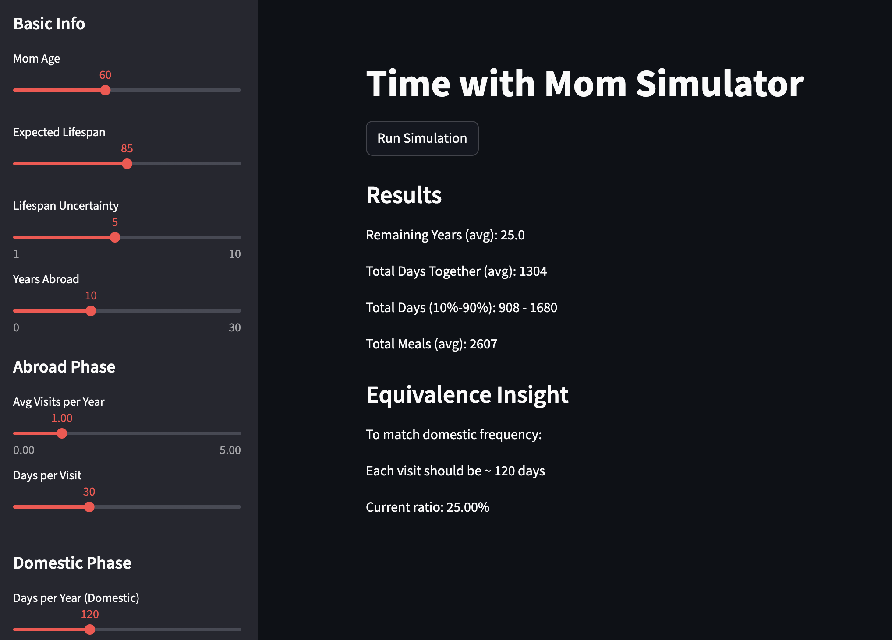

# Time with Mom Simulator

A Monte Carlo-based simulation tool for modeling long-term family time under uncertainty.

This project quantifies how life decisions — such as working abroad — impact total time spent with family, transforming an emotional question into a data-driven decision problem.

---

## ❤️ Why this project

This project was inspired by a Korean movie adapted from the Japanese novel:

*“The number of times you will eat your mother’s home-cooked meals is only 328.”*

After watching the film, I was struck by a simple but powerful idea:

> Time with our parents feels abundant — but is actually finite.

That night, I built this Python package.

**TWM (Time With Mom)** is not just a simulation tool —
it is a reminder:

> **Cherish every meal with your mom.**

---

## 🚀 Overview

Most people intuitively understand that “time is limited,” but few can quantify how different life choices affect long-term family time.

This project provides a structured way to evaluate:

* How often to visit vs. how long to stay
* Trade-offs between working abroad and staying domestic
* The impact of aging on future time availability

---

## 📊 Demo (Streamlit)

Interactive dashboard for exploring different life strategies.

---

## ✨ Features

* Monte Carlo simulation
* Aging decay modeling
* Stochastic visit frequency
* Multi-phase life modeling
* Decision insights
* Python API + CLI + Web UI

---

## 📦 Installation

pip install time-with-mom

---

## 🧠 Usage

### CLI

time-with-mom simulate --visits 2 --days 30

---

### Web App

streamlit run app/streamlit_app.py

---

## 🎯 Positioning

* Data Science (simulation, uncertainty)
* Decision Science (trade-offs)
* Product Thinking (CLI + Web + package)

---

